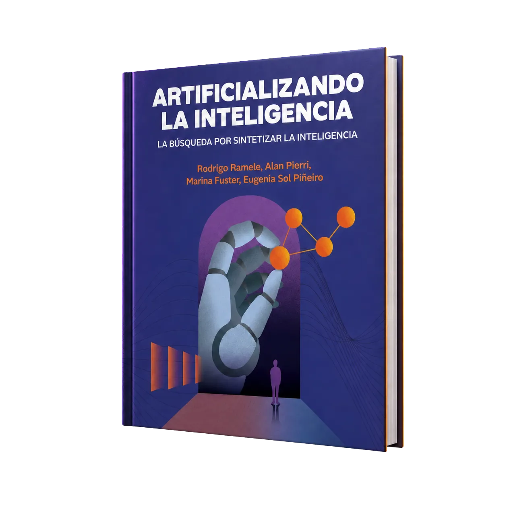

# Artificializando la Inteligencia

Sitio oficial de *Artificializando la Inteligencia*, un libro en español que presenta los fundamentos, algoritmos y aplicaciones modernas de la inteligencia artificial con rigor y un lenguaje cercano.

El sitio reúne información sobre el contenido del libro, sus autores, materiales para clases y novedades del proyecto.

[Visitar el sitio web](https://artificializandolainteligencia.github.io/)
